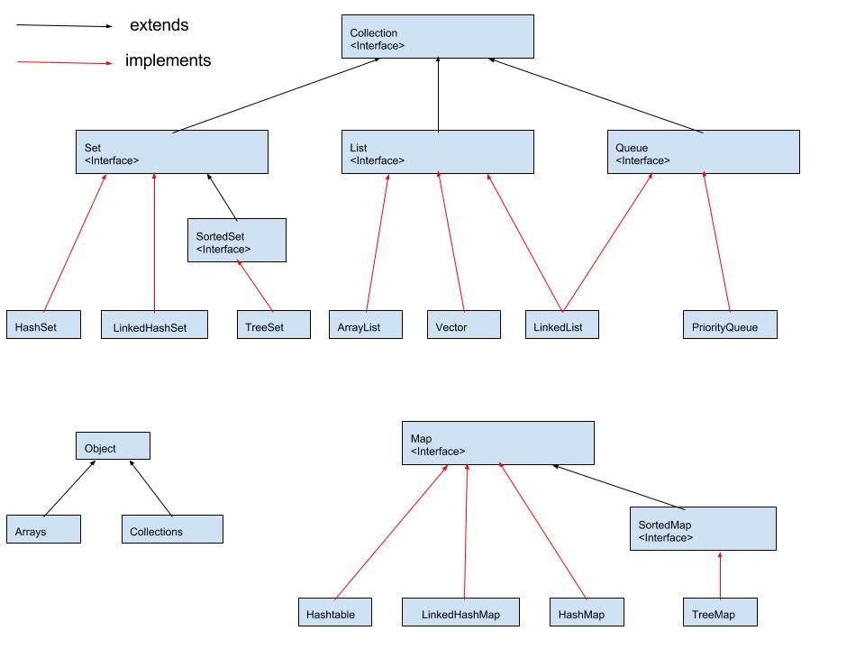
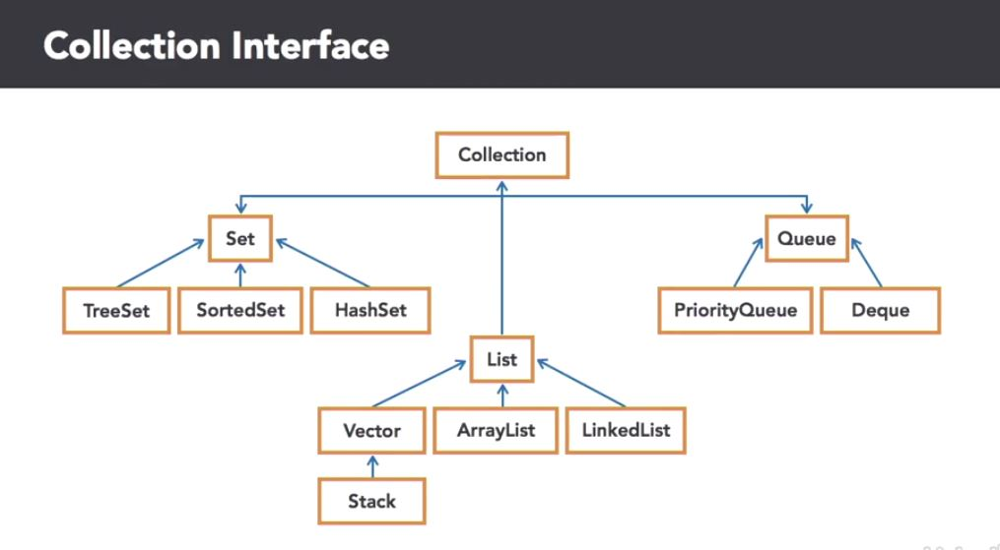

Java language learning.
### tutorials point [Java Tutorial](https://www.tutorialspoint.com/java/index.htm)
### javatpoint [Java Tutorial](https://www.javatpoint.com/java-tutorial)
### javatutorialhq [Java Tutorial](http://javatutorialhq.com/java/)

# QA
- [Difference between add() and offer() methods of Queue interface](https://stackoverflow.com/questions/20526910/difference-between-add-and-offer-methods-of-queue-interface)
  ```
  Queue.add - throws an exception if the operation fails,
  Queue.offer - returns a special value (either null or false, depending on the operation).
  ```
- [Queue remove vs poll](https://stackoverflow.com/questions/2193450/why-java-provides-two-methods-to-remove-element-from-queue)
  ```
  The remove() and poll() methods differ only in their behavior when the queue is empty:
  the remove() method throws an exception, 
  while the poll() method returns null
  ```

# 1. Basics 
### local variable VS. instance variable
- local variable: variable declared inside method;
- instance variable: variable decalred inside class but outside method.
### primitive VS. reference types
- Primitive types
  - boolean, byte, char, short, int, long, float, double
  - Variable holds one value of given type
  - boolean instance variables, initialized to _**false**_
  - Other primitive instance variables initialized to _**0**_
  - Do NOT have methods
  - promotion rules
    - argument promotion
      - converting an argument's value, if possible, to the type that the method expects to receive in its corresponding parameter
      - only promote from lower to higher type, eg. short -> int. NOT long -> short. Allowed promotions:
        - double -> None
        - float -> double
        - long -> float or double
        - int -> long, float or double
        - char -> int, long, float or double
        - short -> int, long, float or double
        - byte -> short, int, long, float or double
        - boolean -> None. _**boolean values are not considered to be numbers in Java.**_
      - may lead to compilation errors if Java's promotion rules are not satisfied
  
- Reference types
  - Any non-primitive type is a reference type
  - Variable refer to objects that may contain many instance variables
  - Default instance variable value is _**null**_ - reference to nothing
  - Reference required to call an object's methods

### Methods : in-depth
- **static** methods and variables
  - static methods perform tasks that do not require an object of the class
  - static method call : `ClassName.methodName(args)`
  - Docs show which class members are static. Example: Math class.
  - Modifiers : public, final, static
    - public : allows you to use these fields in your own classes
    - final : the value is constant and cannot be changed after initialization
    - static : access via the class name and a dot(.) separator
  - All objects of a class share one copy of the class's static fields
  - Fields of a class - class variables and instance variables
  
- why **main** is static

- some common Java packages
  - [Java SE8 packages documentation](http://docs.oracle.com/javase/8/docs/api/index.html)
  
- secure random number generation
  - `import java.security.SecureRandom`
  
- named constants with **enum** types

- scope of identifiers
  - Parameter declaration: body of the method in which the declaration appears
  - Local-variable declaration: from the declaration to the end of that block
  - Local-variable declaration that appears in the initialization section of a _for_ statement's header: entire for statement
  - Method or field's scope:
    - entire body of the class
    - instance methods can use all class members
    
- method overloading

### Array and ArrayList
- declare an array w/o initialization
  ```
  int[] arr0 = new int[10];
  int[] arr1 = {1,2,3,4,5,6,7};
  ```

- Enhanced _**for**_ loop
  ```
  int[] arr = {3,1,5,8,2,9,7,6,4};
  int total = 0;
  for (int num : arr) {
    total += num;
  }
  System.out.printf("Total of array elements : %d%n", total);
  ```
  
- java.util.Arrays
- java.util.ArrayList

# 2. Java Collections Framework
- [tutorial](http://beginnersbook.com/java-collections-tutorials/)





## [Queue](https://beginnersbook.com/2017/08/queue-interface-in-java-collections/)
### basic operations

 Operation | Throws exception | Returns special value
 --------- | ---------------- | -----------------------
 inserts the element e to the tail of the queue. | add(E e): If there is no space available because of capacity restrictions, IllegalStateException is thrown. | offer(E e): If the insertion is successful the method returns true, otherwise it returns false. Generally, if there are capacity bounds, it is preferred to use add method instead.
 removes and returns the head (the first element) of the queue. | remove(): throw NoSuchElementException if the queue is empty. | poll(): returns null when the queue is empty.
 returns the head of the queue, without removing it. | element(): throw NoSuchElementException if the queue is empty. | peek(): return null is the queue is empty.

## [LinkedList](https://beginnersbook.com/2013/12/linkedlist-in-java-with-example/)
`LinkedList<T> llist  = new LinkedList<T>();`

- [LinkedList to array](https://beginnersbook.com/2014/07/how-to-convert-linkedlist-to-array-using-toarray-in-java/)
```
    //Creating and populating LinkedList
    LinkedList<String> linkedlist = new LinkedList<String>();
    linkedlist.add("Harry");
    linkedlist.add("Maddy");
    linkedlist.add("Chetan");
    linkedlist.add("Chauhan");
    linkedlist.add("Singh");

    //Converting LinkedList to Array
    String[] array = linkedlist.toArray(new String[linkedlist.size()]);
```

## [ArrayList](https://beginnersbook.com/2013/12/java-arraylist/)
`ArrayList<T> obj = new ArrayList<T>();`

## [ArrayList VS. LinkedList](https://beginnersbook.com/2013/12/difference-between-arraylist-and-linkedlist-in-java/)

Operation | performance    ArrayList  :   LinkedList
--------- | -------------------------------------------
Search : get(int index) |  O(1)  :  O(n)
Deletion : remove(int index) | O(n)/O(1)  :  O(1)
Inserts : add(int index) |  O(n)/O(1)  :  O(1)

## [HashMap](http://javatutorialhq.com/java/util/hashmap-class/)
- iterate hashmap
```
Map<String, Integer> items = new HashMap<>();
items.put("A", 10);
items.put("B", 20);
items.put("C", 30);
items.put("D", 40);
items.put("E", 50);
items.put("F", 60);

for (Map.Entry<String, Integer> entry : items.entrySet()) {
	System.out.println("Item : " + entry.getKey() + " Count : " + entry.getValue());
}
```

In Java 8, you can loop a Map with forEach + lambda expression.
```
Map<String, Integer> items = new HashMap<>();
items.put("A", 10);
items.put("B", 20);
items.put("C", 30);
items.put("D", 40);
items.put("E", 50);
items.put("F", 60);

items.forEach((k,v)->System.out.println("Item : " + k + " Count : " + v));

items.forEach((k,v)->{
	System.out.println("Item : " + k + " Count : " + v);
	if("E".equals(k)){
		System.out.println("Hello E");
	}
});
```

