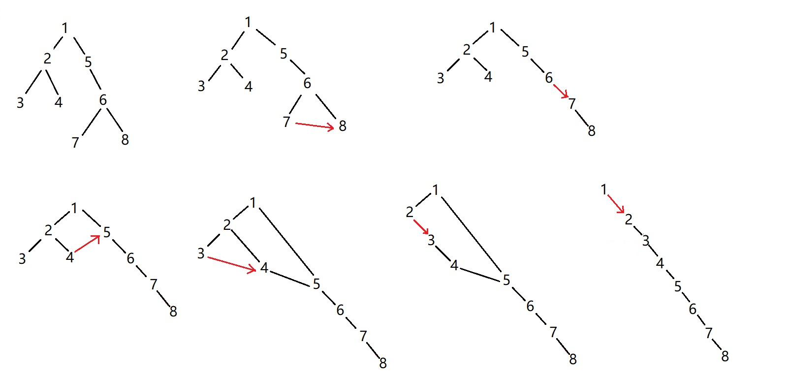
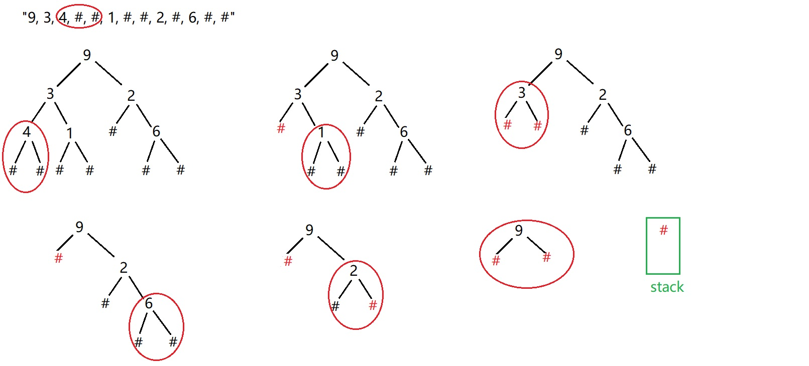

# [114. Flatten Binary Tree to Linked List](https://leetcode.com/problems/flatten-binary-tree-to-linked-list/description/)

## Description
Given a binary tree, flatten it to a linked list in-place.

For example,
Given
```
         1
        / \
       2   5
      / \   \
     3   4   6
```
The flattened tree should look like:
```
   1
    \
     2
      \
       3
        \
         4
          \
           5
            \
             6
```

## Solution
### brute force
Traverse tree in pre-Order and save nodes to ArrayList sequentially. Then link all the nodes, every node is the right of it's parent node, and every node's left set to null.
```
class Solution {
    ArrayList<TreeNode> nodeList = new ArrayList<TreeNode>();
    public void flatten(TreeNode root) {
        preOrder(root);
        TreeNode node = null;
        for(int i = 0; i < nodeList.size()-1; i++) {
            node = nodeList.get(i);
            node.left = null;
            node.right = nodeList.get(i+1);
        }
    }
    private void preOrder(TreeNode node) {
        if (node == null)   return;
        nodeList.add(node);
        preOrder(node.left);
        preOrder(node.right);
    }
}
```

### In-place flatten (recursive: bottom->up, right->left)

_**reverse pre-Order**_
```
class Solution {
    private TreeNode prev = null;
    public void flatten(TreeNode root) {
        if(root == null) return;
        flatten(root.right);
        flatten(root.left);
        root.right = prev;
        root.left = null;
        prev = root;
    } 
}
```

# [331. Verify Preorder Serialization of a Binary Tree](https://leetcode.com/problems/verify-preorder-serialization-of-a-binary-tree/description/)

## Description
One way to serialize a binary tree is to use pre-order traversal. When we encounter a non-null node, we record the node's value. If it is a null node, we record using a sentinel value such as #.
```
     _9_
    /   \
   3     2
  / \   / \
 4   1  #  6
/ \ / \   / \
# # # #   # #
```
For example, the above binary tree can be serialized to the string "9,3,4,#,#,1,#,#,2,#,6,#,#", where # represents a null node.

Given a string of comma separated values, verify whether it is a correct preorder traversal serialization of a binary tree. Find an algorithm without reconstructing the tree.

Each comma separated value in the string must be either an integer or a character '#' representing null pointer.

You may assume that the input format is always valid, for example it could never contain two consecutive commas such as "1,,3".

Example 1:
"9,3,4,#,#,1,#,#,2,#,6,#,#"
Return _true_

Example 2:
"1,#"
Return _false_

Example 3:
"9,#,#,1"
Return _false_

## solution
### brute force
Each leaf is represented as "number, #, #". We scan the character array from left to right, and use a stack to maintain characters. When we meet a "#", then check if it's previous character is also a "#", if yes, then pop twice and check again. As long as the prev char is "#", keep pop twice. If not, push one "#", which means we use a null to replace the leaf node. When we done the array traverse, if the stack length is 1 and only contains a "#", return true.

```
class Solution {
    public boolean isValidSerialization(String preorder) {
        Stack<String>  chars = new Stack();
        for (String c : preorder.split(",")) {
            while (c.equals("#") && !chars.isEmpty() && chars.peek().equals(c)) {
                chars.pop();
                if (chars.isEmpty())    return false;
                chars.pop();
            }
            chars.push(c);
        }
        return chars.size() == 1 && chars.peek().equals("#");
    }
}
```

### indegree and outdegree
In a binary tree, 
- root node provide 0 indegree and 2 outdegree (no parent and 2 children)
- all non-null/non-root node provides 1 indegree and 2 outdegree (1 parent and 2 children)
- all null node provides 1 indegree and 0 outdegree (1 parent and 0 child)

Suppose we try to build this tree. During building, we record the difference between out degree and in degree diff = outdegree - indegree. When the next node comes, we then decrease diff by 1, because the node provides an in degree. If the node is not null, we increase diff by 2, because it provides two out degrees. If a serialization is correct, diff should never be negative and diff will be zero when finished.

Because the first node is root and it has no indegree, so we initialize diff = 1 and after -- the indegree is 0, it's called compensation.

```
class Solution {
    public boolean isValidSerialization(String preorder) {
        int diff = 1;
        for (String node: preorder.split(",")) {
            if (--diff < 0) return false;
            if (!node.equals("#")) diff += 2;
        }
        return diff == 0;
    }
}
```

# [103. Binary Tree Zigzag Level Order Traversal](https://leetcode.com/problems/binary-tree-zigzag-level-order-traversal/description/)
## Description
Given a binary tree, return the zigzag level order traversal of its nodes' values. (ie, from left to right, then right to left for the next level and alternate between).

For example:
Given binary tree [3,9,20,null,null,15,7],
```
    3
   / \
  9  20
    /  \
   15   7
```   
return its zigzag level order traversal as:
```
[
  [3],
  [20,9],
  [15,7]
]
```
## Solution
Learn usage of List of List, add()/add(i).
```
class Solution {
    public List<List<Integer>> zigzagLevelOrder(TreeNode root) {
        List<List<Integer>>  res = new ArrayList<List<Integer>>();
        traverse(root, 0, res);
        return res;
    }
    private void traverse(TreeNode node, int level, List<List<Integer>> list) {
        if (node == null)   return;
        if (list.size() <= level)    list.add(new LinkedList<Integer>());
        List<Integer>  curList = list.get(level);
        if (level%2 == 0)  {
            curList.add(node.val);
        } else {
            curList.add(0, node.val);
        }
        traverse(node.left, level + 1, list);
        traverse(node.right, level + 1, list);
    }
}
```
---
# [Construct Binary Tree From Inorder and Preorder/Postorder Traversal](http://articles.leetcode.com/construct-binary-tree-from-inorder-and-preorder-postorder-traversal)

## Analysis Inorder and Preorder
```
        _______7______
       /              \
    __10__          ___2
   /      \        /
   4       3      _8
            \    /
             1  11
```
preorder = {_**7**_,10,4,3,1,2,8,11}

inorder = {4,10,3,1,_**7**_,11,8,2}

In _**preorder traversal**_ we always traverse the root node before its children. The root node’s value appear to be **7** from the binary tree above.

For _**inorder traversal**_, we visit the left subtree first, then root node, and followed by the right subtree. Therefore, all elements left of **7** must be in the left subtree and all elements to the right must be in the right subtree.

We see a clear recursive pattern from the above observation. After creating the root node (7), we construct its left and right subtree from inorder traversal of {4, 10, 3, 1} and {11, 8, 2} respectively. We also need its corresponding preorder traversal which could be found in a similar fashion. If you remember, preorder traversal follows the sequence of root node, left subtree and followed by right subtree. Therefore, the left and right subtree’s postorder traversal must be {10, 4, 3, 1} and {2, 8, 11} respectively. Since the left and right subtree are binary trees in their own right, we can solve recursively!

## Analysis Inorder and Postorder
```
        _______7______
       /              \
    __10__          ___2
   /      \        /
   4       3      _8
            \    /
             1  11
```
postorder = {4,1,3,10,11,8,2,_**7**_}

inorder = {4,10,3,1,_**7**_,11,8,2}

In _**postorder traversal**_ we always traverse the root node after its children. The root node’s value appear to be **7** from the binary tree above. Observe the postorder array from right to left (7->2->8->11->10->3->1->4), we can find each element is root of subtree. Hence we can use similar solution as inorder and preorder traversal.

## [105. Construct Binary Tree from Preorder and Inorder Traversal](https://leetcode.com/problems/construct-binary-tree-from-preorder-and-inorder-traversal/description/)
### Description
Given preorder and inorder traversal of a tree, construct the binary tree.

Note:
You may assume that duplicates do not exist in the tree.

### Solution
- Recursive
```
class Solution {
    public TreeNode buildTree(int[] preorder, int[] inorder) {
        return buildSubtree(0, 0, inorder.length-1, preorder, inorder);
    }
    private TreeNode buildSubtree(int preIdx, int inStart, int inEnd, int[] preorder, int[] inorder) {
        if (preIdx > preorder.length - 1 || inStart > inEnd) {
            return null;
        }
        
        TreeNode node = new TreeNode(preorder[preIdx]);
        int inIdx = 0;
        for (int i = inStart; i <= inEnd; i++) {
            if (inorder[i] == node.val)   {
                inIdx = i;
                break;
            }
        }
        node.left = buildSubtree(preIdx+1, inStart, inIdx-1, preorder, inorder);
        node.right = buildSubtree(preIdx+inIdx-inStart+1, inIdx+1, inEnd, preorder, inorder);
        return node;
    }
}
```

- [Iterative way](https://discuss.leetcode.com/topic/795/the-iterative-solution-is-easier-than-you-think)
  Keep making the tree by adding nodes to the left of the previous node, until the value matches the inorder.
```
class Solution {
    int in = 0;
    int pre = 0;
    
    public TreeNode buildTree(int[] preorder, int[] inorder) {
        return aux(preorder, inorder, Integer.MAX_VALUE);
    }
    
    private TreeNode aux(int[] preorder, int[] inorder, int border) {
        if (in >= inorder.length || pre >= preorder.length || inorder[in] == border) {
            return null;
        }
        
        TreeNode root = new TreeNode(preorder[pre++]);
        root.left = aux(preorder, inorder, root.val);
        in++;
        root.right = aux(preorder, inorder, border);
        
        return root;
    }
```

## [106. Construct Binary Tree from Inorder and Postorder Traversal](https://leetcode.com/problems/construct-binary-tree-from-inorder-and-postorder-traversal/description/)
### Description
Given inorder and postorder traversal of a tree, construct the binary tree.

Note:
You may assume that duplicates do not exist in the tree.

### Solution
- Recursive
```
class Solution {
    public TreeNode buildTree(int[] inorder, int[] postorder) {
        return buildSubtree(postorder.length-1, 0, inorder.length-1, postorder, inorder);
    }
    private TreeNode buildSubtree(int preIdx, int inStart, int inEnd, int[] postorder, int[] inorder) {
        if (preIdx < 0 || inStart > inEnd) {
            return null;
        }
        
        TreeNode node = new TreeNode(postorder[preIdx]);
        int inIdx = 0;
        for (int i = inStart; i <= inEnd; i++) {
            if (inorder[i] == node.val)   {
                inIdx = i;
                break;
            }
        }
        node.right = buildSubtree(preIdx-1, inIdx+1, inEnd, postorder, inorder);
        node.left = buildSubtree(preIdx-(inEnd-inIdx+1), inStart, inIdx-1, postorder, inorder);
        return node;
    }
}
```

- Iterative
  Keep making the tree by adding nodes to the right of the previous node, until the value matches the inorder.
```
class Solution {
    int in = 0;
    int pre = 0;
    
    public TreeNode buildTree(int[] inorder, int[] postorder) {
        in = pre = inorder.length - 1;
        return aux(inorder, postorder, Integer.MAX_VALUE);
    }
    
    private TreeNode aux(int[] inorder, int[] postorder, int border) {
        if (in < 0 || pre < 0 || inorder[in] == border) {
            return null;
        }
        
        TreeNode root = new TreeNode(postorder[pre--]);
        root.right = aux(inorder, postorder, root.val);
        in--;
        root.left = aux(inorder, postorder, border);
        
        return root;
    }
}
```
---

# [652. Find Duplicate Subtrees](https://leetcode.com/problems/find-duplicate-subtrees/description/)


# [449. Serialize and Deserialize BST](https://leetcode.com/problems/serialize-and-deserialize-bst/description/)
