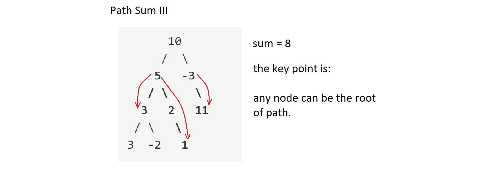
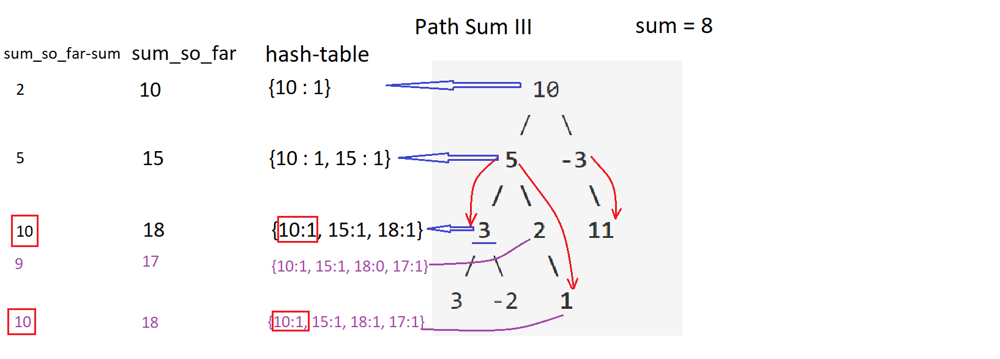

# [112. Path Sum](https://leetcode.com/problems/path-sum/description/)  -  Easy
## Problem Description
Given a binary tree and a sum, determine if the tree has a _**root-to-leaf path**_ such that adding up all the values along the path equals the given sum.

For example:
Given the below binary tree and sum = 22,
```
              5
             / \
            4   8
           /   / \
          11  13  4
         /  \      \
        7    2      1
```        
return true, as there exist a root-to-leaf path 5->4->11->2 which sum is 22.

## Solution
```
/**
 * Definition for a binary tree node.
 * function TreeNode(val) {
 *     this.val = val;
 *     this.left = this.right = null;
 * }
 */
/**
 * @param {TreeNode} root
 * @param {number} sum
 * @return {boolean}
 */
 var hasPathSum = function(root, sum) {
    var result = false;
    
    function findPath(node, sum) {
        if (!node)   return;
        
        sum -= node.val;
        if (!node.left && !node.right && sum === 0) {
            result = true;
            return;
        }
                
        findPath(node.left, sum);
        findPath(node.right, sum);
    }
    
    findPath(root, sum);
    return result;
};
```

# [437. Path Sum III](https://leetcode.com/problems/path-sum-iii/description/)  -  Easy
## Problem Description
You are given a binary tree in which each node contains an integer value.

Find the number of paths that sum to a given value.

_**The path does not need to start or end at the root or a leaf, but it must go downwards (traveling only from parent nodes to child nodes).**_

The tree has no more than 1,000 nodes and the values are in the range -1,000,000 to 1,000,000.

Example:
```
root = [10,5,-3,3,2,null,11,3,-2,null,1], sum = 8

      10
     /  \
    5   -3
   / \    \
  3   2   11
 / \   \
3  -2   1

Return 3. The paths that sum to 8 are:

1.  5 -> 3
2.  5 -> 2 -> 1
3. -3 -> 11
```

## Solution


Base on problem 112's idea, we need to add one more recursion for starting path from any node. The total sum equals to : the path num start from current node + path sum start from left of current node + path sum start from right of current node.
```
/**
 * Definition for a binary tree node.
 * function TreeNode(val) {
 *     this.val = val;
 *     this.left = this.right = null;
 * }
 */
/**
 * @param {TreeNode} root
 * @param {number} sum
 * @return {number}
 */
var pathSum = function(root, sum) {
    if (!root)   return 0;
    
    function findPath(node, val) {
        if (!node)   return 0;
        return (node.val === val) + findPath(node.left, val - node.val) + findPath(node.right, val - node.val);
    }
    
    return findPath(root, sum) + pathSum(root.left, sum) + pathSum(root.right, sum);
};

```

### [Optimization](https://discuss.leetcode.com/topic/65100/python-solution-with-detailed-explanation)
Use hashtable (extra space) get O(N) time complexity.
- As we traverse down the tree, at an arbitrary node N, we store the sum from root to this node N (sum_so_far = sum_so_far (prefix) + N.val) in hash-table as KEY, and VALUE++. Which means we found VALUE number of paths whose sum equal to KEY.
- For each node N, we check if (sum_so_far - sum) exist in hash-table, if yes, `result += hash[sum_so_far - sum]`. The reason is for example, if we have path `[a,b,c,d,e,f]`, if `Sum(a~f) - Sum(a~c) = target`, then path d->e->f sum equals to target. As we stored `Sum(a~c)` and `Sum(a~f)` in hash-table, so if `Sum(a~f) - target = Sum(a~c)` which also means path exist.
- After we are done with a node and all its grandchildren, we remove it from the hash-table. This makes sure that the number of complement paths returned always correspond to paths that ended at a predecessor node.

```
/**
 * Definition for a binary tree node.
 * function TreeNode(val) {
 *     this.val = val;
 *     this.left = this.right = null;
 * }
 */
/**
 * @param {TreeNode} root
 * @param {number} sum
 * @return {number}
 */
var pathSum = function(root, sum) {
    let map = {};
    map[0] = 1;
    return helper(root, 0, sum);
    
    function helper(root, curr, target) {
        if (!root) return 0;
        curr += root.val;
        let res = map[curr - target] || 0;
        map[curr] = (map[curr] || 0) + 1;
        
        res += helper(root.left, curr, target) + helper(root.right, curr, target);
        map[curr] = map[curr] - 1;
        return res;
    }
};
```

# [113. Path Sum II](https://leetcode.com/problems/path-sum-ii/description/)  -  Medium
## Problem Description
Given a binary tree and a sum, find all root-to-leaf paths where each path's sum equals the given sum.
```
For example:
Given the below binary tree and sum = 22,
              5
             / \
            4   8
           /   / \
          11  13  4
         /  \    / \
        7    2  5   1
return
[
   [5,4,11,2],
   [5,8,4,5]
]
```
## Solution
Traverse every node and keep track of all node element from root to current node in an array. If the sum from root to current node equalt to target sum and current node is leaf, then push the array to result array.
```
/**
 * Definition for a binary tree node.
 * function TreeNode(val) {
 *     this.val = val;
 *     this.left = this.right = null;
 * }
 */
/**
 * @param {TreeNode} root
 * @param {number} sum
 * @return {number[][]}
 */

var pathSum = function(root, sum) {
    var result = [];
    findPath(root, sum, []);
    return result;
    
    function findPath(node, target, arr) {
        if (!node)   return;        
        arr.push(node.val);
        if (node.val === target && !node.left && !node.right) result.push(arr.slice());
        findPath(node.left, target-node.val, arr);
        findPath(node.right, target-node.val, arr);
        arr.pop();
    }
};
```

# [64. Minimum Path Sum](https://leetcode.com/problems/minimum-path-sum/description/)   -   Medium  -  Graph ???

# [129. Sum Root to Leaf Numbers](https://leetcode.com/problems/sum-root-to-leaf-numbers/description/)  -  Medium
## Problem Description
Given a binary tree containing digits from 0-9 only, each root-to-leaf path could represent a number.

An example is the root-to-leaf path 1->2->3 which represents the number 123.

Find the total sum of all root-to-leaf numbers.

For example,
```
    1
   / \
  2   3
```  
The root-to-leaf path 1->2 represents the number 12.
The root-to-leaf path 1->3 represents the number 13.

Return the sum = 12 + 13 = 25.

## Solution
Basic idea is similar as 113, the difference is recode the "path value". When meet leaf, add path value to total sum.
```
/**
 * Definition for a binary tree node.
 * function TreeNode(val) {
 *     this.val = val;
 *     this.left = this.right = null;
 * }
 */
/**
 * @param {TreeNode} root
 * @return {number}
 */
var sumNumbers = function(root) {
    var sum = 0;
    helper(root, 0);
    return sum;
    
    function helper(node, path_sum) {
        if (!node)     return;

        path_sum = path_sum*10 + node.val;
        if (!node.left && !node.right) {
            sum += path_sum;
        } else {
            helper(node.left, path_sum);
            helper(node.right, path_sum);
        }
    }
};    
```

# [120. Triangle](https://leetcode.com/problems/triangle/description/)   -   Medium

# [666. Path Sum IV](https://leetcode.com/problems/path-sum-iv)  -  Medium, Locked

# [124. Binary Tree Maximum Path Sum](https://leetcode.com/problems/binary-tree-maximum-path-sum/description/)  -  Hard
