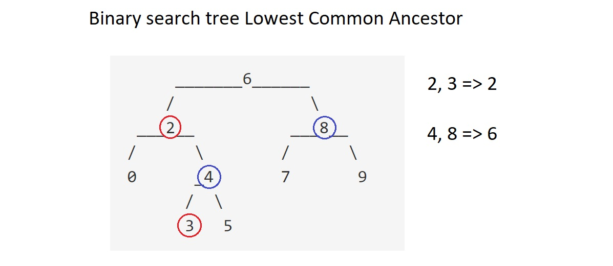
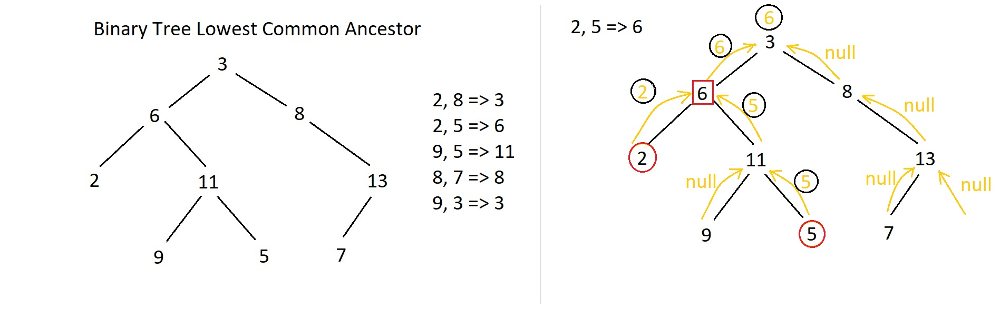

# [235. Lowest Common Ancestor of a Binary Search](https://leetcode.com/problems/lowest-common-ancestor-of-a-binary-search-tree)
## Problem Description
Given a binary search tree (BST), find the lowest common ancestor (LCA) of two given nodes in the BST.

According to the [definition of LCA on Wikipedia](https://en.wikipedia.org/wiki/Lowest_common_ancestor): “The lowest common ancestor is defined between two nodes v and w as the lowest node in T that has both v and w as descendants (where we allow a node to be a descendant of itself).”
```
        _______6______
       /              \
    ___2__          ___8__
   /      \        /      \
   0      _4       7       9
         /  \
         3   5
```         
For example, the lowest common ancestor (LCA) of nodes 2 and 8 is 6. Another example is LCA of nodes 2 and 4 is 2, since a node can be a descendant of itself according to the LCA definition.

## Solution

Basic idea is the LCA of p and q must satisfy this condition: LCA's value is between p.val and q.val (i.e.  `Min(p.val, q.val) <= node.val <= Max(p.val, q.val)`). So if it is less than Min(p.val, q.val) we keep search in right subtree, else search left subree.
```
/**
 * Definition for a binary tree node.
 * function TreeNode(val) {
 *     this.val = val;
 *     this.left = this.right = null;
 * }
 */
/**
 * @param {TreeNode} root
 * @param {TreeNode} p
 * @param {TreeNode} q
 * @return {TreeNode}
 */
var lowestCommonAncestor = function(root, p, q) {
    if (root.val < Math.min(p.val, q.val))    return lowestCommonAncestor(root.right, p, q);
    if (root.val > Math.max(p.val, q.val))    return lowestCommonAncestor(root.left, p, q);
    return root;
};
```

# [236. Lowest Common Ancestor of a Binary Tree](https://leetcode.com/problems/lowest-common-ancestor-of-a-binary-tree/description/) Medium
## Problem Description
Given a binary tree, find the lowest common ancestor (LCA) of two given nodes in the tree.

According to the [definition of LCA on Wikipedia](https://en.wikipedia.org/wiki/Lowest_common_ancestor): “The lowest common ancestor is defined between two nodes v and w as the lowest node in T that has both v and w as descendants (where we allow a node to be a descendant of itself).”
```
        _______3______
       /              \
    ___5__          ___1__
   /      \        /      \
   6      _2       0       8
         /  \
         7   4
```         
For example, the lowest common ancestor (LCA) of nodes 5 and 1 is 3. Another example is LCA of nodes 5 and 4 is 5, since a node can be a descendant of itself according to the LCA definition.

## Solution

Basic idea is traverse tree and look for p, q. If current node is p or q, return it. If not, continue traverse left and right subtree and if not exist in subtree get null. If left and right are all null, return null; if left and right are all not null, return current node (it is the LCA); if either left or right is not null, return the not null node.
```
/**
 * Definition for a binary tree node.
 * function TreeNode(val) {
 *     this.val = val;
 *     this.left = this.right = null;
 * }
 */
/**
 * @param {TreeNode} root
 * @param {TreeNode} p
 * @param {TreeNode} q
 * @return {TreeNode}
 */
var lowestCommonAncestor = function(root, p, q) {
    if (root === null || root === p || root === q)    return root;
    var left = lowestCommonAncestor(root.left, p, q);
    var right = lowestCommonAncestor(root.right, p, q);
    /*
      if (!left && !right)   return null;
      if (left && right)     return root;
      return !left ? right : left;
    */
    return !left ? right : (!right ? left : root);
};
```
